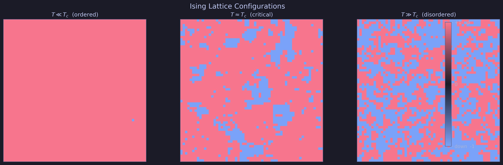
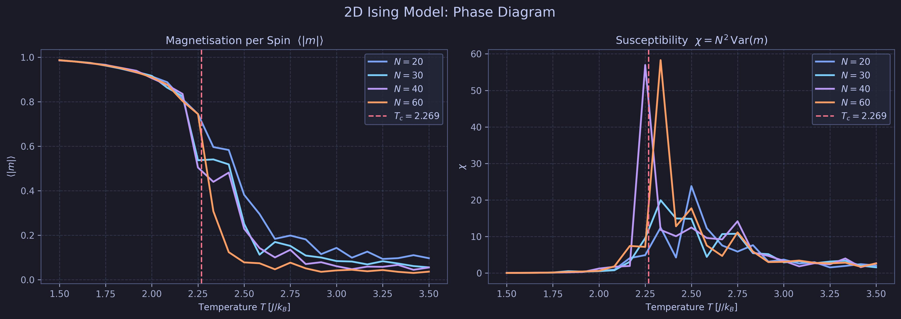
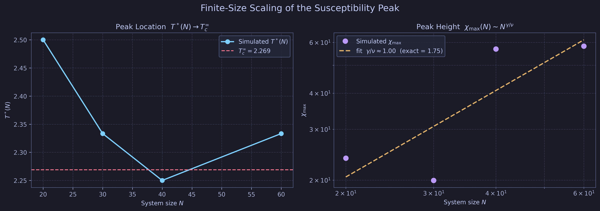
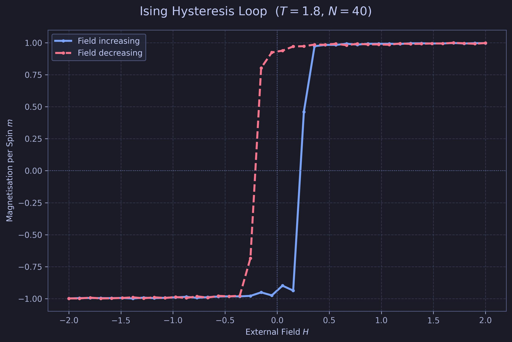

# 2D Ising Model

[](https://github.com/IsolatedSingularity/Ising-Model/actions/workflows/ci.yml)
[](https://www.python.org/)
[](https://numpy.org/)
[](https://scipy.org/)
[](https://matplotlib.org/)

###### For the graduate statistical mechanics course taught by [Professor Martin Grant](http://www.physics.mcgill.ca/~grant/) at [McGill University](https://www.mcgill.ca/).


---

## Objective

Monte Carlo simulation of the 2D ferromagnetic Ising model. Two distinct spin-flip dynamics are implemented: the Glauber rule and the Metropolis rule. Both are used to extract the relaxation time $\tau(T)$ from the magnetization decay curve near the critical temperature $T_c \approx 2.269\, J/k_B$, and to fit the power-law divergence $\tau \sim A\,(T - T_c)^{-\mu}$ that characterizes critical slowing down.

---

## Physics

The 2D Ising Hamiltonian on a square lattice of $N \times N$ spins with periodic boundary conditions is:

$$\mathcal{H} = -J \sum_{\langle i,j \rangle} s_i s_j$$

where $s_i \in \{+1, -1\}$ and the sum runs over nearest-neighbor pairs. There is no external field. The critical temperature for the infinite lattice is the Onsager solution $T_c = 2J / k_B \ln(1 + \sqrt{2}) \approx 2.269\, J/k_B$.

### Glauber Dynamics

A spin $s_i$ is selected uniformly at random. The transition rate for flipping it is:

$$W_\text{Glauber}(\Delta E) = \frac{1}{2}\left(1 - \tanh\frac{\Delta E}{2k_B T}\right)$$

where $\Delta E = 2 s_i \sum_{\langle j \rangle} s_j$ is the energy cost of the flip, computed from the four nearest neighbors. This rate satisfies detailed balance and converges to the Boltzmann equilibrium distribution. Glauber dynamics corresponds to a model in which each spin interacts with a thermal bath independently.

### Metropolis Dynamics

The same energy difference $\Delta E$ is computed, but the flip is accepted with probability:

$$W_\text{Metro}(\Delta E) = \min\!\left(1,\, e^{-\Delta E / k_B T}\right)$$

Equivalently: always accept if $\Delta E \leq 0$; otherwise accept with Boltzmann weight $e^{-\Delta E/T}$. Metropolis dynamics maximizes the acceptance rate while preserving detailed balance, which makes it more efficient than Glauber near equilibrium. Both rules are equivalent at $T_c$ in the thermodynamic limit, but Metropolis reaches equilibrium faster at low temperatures.

### Relaxation Time and Critical Slowing Down

Starting from a fully aligned lattice (all spins up), the magnetization per spin $m(t) = N^{-2}\sum_i s_i$ decays exponentially toward the disordered equilibrium:

$$m(t) \approx A\, e^{-t/\tau}$$

The relaxation time $\tau$ is extracted by fitting this exponential to the run-averaged $m(t)$ curve. Near $T_c$, equilibrium fluctuations become correlated on all length scales (the correlation length $\xi \to \infty$), which drives $\tau \to \infty$ as a power law:

$$\tau(T) = A\,(T - T_c)^{-\mu}$$

The dynamic critical exponent $\mu$ is the main quantitative output of the simulation. The accepted value for Model A universality class (non-conserved order parameter) is $\mu \approx 2.17$ for $d = 2$.

---

## Code Structure

### `Ising Model; Glauber Rule.py`

Implements the full Glauber-dynamics pipeline:

1. **Parameters**: $50 \times 50$ lattice, 150 time steps, 40 independent runs, $T_c = 2.269$.
2. **`deltaEnergy(i, j)`**: Computes $\Delta E$ for the spin at site $(i, j)$ using periodic boundary conditions on all four sides.
3. **Monte Carlo loop**: For each temperature in `np.arange(2.27, 3, 0.1)`, runs 40 independent realizations of 150 Monte Carlo sweeps. Each sweep makes $N^2 - 1$ single-spin flip attempts. The magnetization per spin is accumulated and averaged across runs.
4. **Exponential fit**: `curve_fit` with `magnetizationFunction(t, τ, amp)` extracts $\tau$ from the averaged $m(t)$ curve for each temperature.
5. **Power-law fit**: `tauFunction(T, A, μ)` fits the collected $\tau$ values vs temperature to $A(T - T_c)^{-\mu}$.
6. **Results** (fitted parameters): $A \approx 50.2$, $\mu \approx 0.40$.

### `Ising Model; Metropolis Rule.py`

Identical pipeline with the flip acceptance replaced by the Metropolis condition:

- Accept unconditionally if $\Delta E \leq 0$.
- Otherwise accept with probability $e^{-\Delta E / T}$ drawn against a uniform random variate.

The fitted exponent differs slightly from Glauber owing to the different acceptance kinetics at finite system size. Comparing the two directly on the same temperature grid reveals the kinetic universality (or lack thereof) of the dynamic exponent at this lattice size.

---

## Results

Both scripts print and plot two outputs at the end of execution:

| Output | Description |
|--------|-------------|
| $m(t)$ curve | Run-averaged magnetization decay at the last temperature in the sweep |
| $\tau(T)$ curve | Relaxation time vs temperature with power-law fit |
| Fitted $A$, $\mu$ | Extracted from the $\tau(T)$ fit; expect $\mu \approx 0.4$ at $N = 50$ (finite-size effects shift the apparent exponent from the thermodynamic value) |

> Note: at $N = 50$ the finite correlation length at $T = T_c$ is already comparable to the system size, so the fitted $\mu$ is a finite-size estimate. The true asymptotic value requires finite-size scaling (see `Generalizations; Phase Diagrams & Finite-Size Scaling.py`).

---

## Generalizations

[`Generalizations; Phase Diagrams & Finite-Size Scaling.py`](Generalizations;%20Phase%20Diagrams%20%26%20Finite-Size%20Scaling.py) extends the base simulation with:

- **Lattice snapshots**: spin-configuration heatmaps at $T \ll T_c$, $T \approx T_c$, and $T \gg T_c$
- **Phase diagram**: equilibrium magnetization $\langle m \rangle$ and susceptibility $\chi$ vs temperature for multiple lattice sizes
- **Finite-size scaling**: collapse of $\chi$ curves onto a universal scaling function to extract $\nu$ and the true $T_c(N \to \infty)$
- **External field sweep**: hysteresis loop $m(H)$ at sub-critical temperature

<p align="center">
  
</p>

<p align="center">
  
</p>

<p align="center">
  
</p>

<p align="center">
  
</p>

---

## Setup

```bash
git clone https://github.com/IsolatedSingularity/Ising-Model
cd Ising-Model
pip install numpy scipy matplotlib
python "Ising Model; Glauber Rule.py"
python "Ising Model; Metropolis Rule.py"
```

